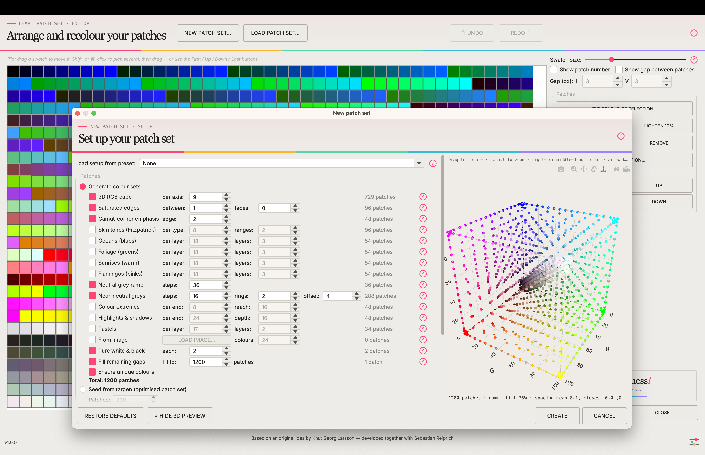

<h1 align="center">ChromIQ Patches</h1>

<p align="center">
  <strong>Design printer test charts and export them straight to i1Profiler — no ArgyllCMS required.</strong>
</p>

<p align="center">
  
  
  
  
</p>

<p align="center">
  
</p>

ChromIQ Patches is the chart-design tool from
[**ChromIQ**](https://github.com/itsab1989/ChromIQ) as a standalone desktop
app: build a set of colour patches with combinable generators, lay them out on
the page with a live preview, and export the result for
**X-Rite/Calibrite i1Profiler** (`.txt` + `.pxf`) — alongside the `.ti1`
patch set, a plain colour list and print-ready TIFF pages.

It grew out of **Knut Georg Larsson's** idea for a patch generator that
doesn't depend on ArgyllCMS `targen`. Knut and Sebastian Reiprich developed
the designer together inside ChromIQ; this repo cuts it loose for everyone
who wants the charts without the full profiling suite.

<p align="center">
  <a href="https://ko-fi.com/itsab1989"></a>
  <br>
  <sub>ChromIQ Patches is free and always will be. If it's useful to you, a coffee is a kind way to say thanks — completely optional, and the app stays fully featured either way.</sub>
</p>

---

## What it does

- **Patch generators** — combinable colour-set generators (RGB cube, neutral
  ramps, near-neutrals, skin tones, blues, greens, gamut-surface sets, …)
  with live patch counts and a 3D RGB-cube preview.
- **Chart layout engine** — lays the patches out as measurable strips with
  spacers, clip margins and instrument-aware geometry for i1Pro and
  ColorMunki, rendered to exact-size print-ready TIFFs. No ArgyllCMS needed.
- **i1Profiler export** — every chart can be exported as `.txt` and `.pxf`
  and imported directly into i1Profiler, so you can design here and measure
  and profile there.
- **`.ti1` patch set** — the patches also save as an ArgyllCMS `.ti1`, so the
  same colours can feed a targen/printtarg-based workflow elsewhere.
- **Built-in presets** — the curated chart line-up from ChromIQ (Knut's
  full-layout setups and the "by Pharmacist" targets) ships in the box.

## What it deliberately isn't

Printing, measuring and profile building stay in
[ChromIQ](https://github.com/itsab1989/ChromIQ) — this app designs charts.
If you want the whole guided workflow (print → measure → ICC profile),
install ChromIQ; ChromIQ Patches is built from the very same code, and the
two share presets: a chart designed here shows up in ChromIQ and vice versa.

## Install

Grab the build for your OS from the
[releases page](https://github.com/itsab1989/chromiq-patches/releases), or run
from source:

```bash
git clone https://github.com/itsab1989/chromiq-patches.git
cd chromiq-patches
python3 -m venv .venv && source .venv/bin/activate
pip install -r requirements.txt
python main.py
```

## Relationship to ChromIQ

This repo vendors its engine modules **byte-identical** from the ChromIQ
codebase (see `tools/sync_from_chromiq.py` for the exact manifest) — fixes
and new generators land in ChromIQ first and flow here with one sync command.
Issues about chart design are welcome in either tracker; profiling-workflow
topics belong to [ChromIQ](https://github.com/itsab1989/ChromIQ/issues).

## Credits

- **Knut Georg Larsson** — the original idea and the chart-design concept,
  developed jointly with Sebastian Reiprich.
- **Sebastian Reiprich** ([itsab1989](https://github.com/itsab1989)) — code
  (written with Claude), as part of ChromIQ.
- **Pharmacist** — the bundled "by Pharmacist" chart targets.
- [ArgyllCMS](https://www.argyllcms.com/) by Graeme Gill defined the `.ti1`/
  `.ti2`/`.cht` formats this app reads and writes (the app itself does not
  include or require ArgyllCMS).

## License

[GPL-3.0](LICENSE) — same as ChromIQ.
